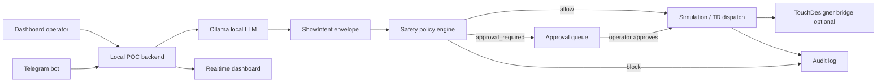

# Live Nervous System — AI Party Control POC

Live Nervous System is a local proof-of-concept for an AI show director with human safety authority. The LLM interprets operator or Telegram text into structured `ShowIntent` JSON; TouchDesigner remains the deterministic real-time runtime; the local policy layer decides whether an action is allowed, queued for approval, or blocked.

> Do not connect real fog, strobe, DMX, PA, mixer, laser, or moving heads until venue-specific fixture mapping, cooldowns, emergency stop, and operator rehearsal have been validated.

## Architecture



## Safety Model

- Dry-run is the default.
- Real hardware requires `HARDWARE_ENABLED=true`, `DMX_LIVE_ENABLED=true`, a policy-allowed plan, and operator approval.
- Raw DMX, raw Python, arbitrary endpoints, channel numbers, blackout, freeze, laser, moving heads, mixer gain, PA mute, and audio routing are blocked.
- Fog and hazer are approval-gated and capped at 3 seconds; fog intensity is capped at 0.45.
- Strobe is approval-gated and capped at 0.25 intensity.
- Panic safe forces the local safe cue and zeros simulated fog/strobe.

## Run

Install dependencies, then copy `.env.example` if you want local overrides.

```bash
npm ci
npm run ai-party:dev
```

Open the printed dashboard URL, normally `http://127.0.0.1:8787/`.

## Ollama

Set:

```bash
OLLAMA_BASE_URL=http://127.0.0.1:11434
OLLAMA_MODEL=qwen2.5:3b
```

No particular model is required. If Ollama is down or the model is missing, the dashboard shows a warning and uses deterministic fallback parsing for the built-in demo commands.

## TouchDesigner

Start the tdmcp bridge at `TD_BRIDGE_URL` and then run:

```bash
npm run ai-party:td-build
```

The builder creates or replaces `/project1/ai_party_poc` with a control panel, visual chain, simulated DMX table, disabled DMX placeholder, and `preview_out`. Every created operator receives deterministic `nodeX`/`nodeY` coordinates.

## Telegram

Set:

```bash
TELEGRAM_BOT_TOKEN=...
TELEGRAM_ALLOWED_CHAT_IDS=123456789
TELEGRAM_POLLING_ENABLED=true
```

Then run:

```bash
npm run ai-party:telegram
```

Supported commands include `/status`, `/cues`, `/cue <cue_name>`, `/mood <text>`, `/fog <seconds> <intensity>`, `/approve <approval_id>`, `/reject <approval_id>`, `/panic`, and `/demo`.

## Dry Run Demo

```bash
npm run ai-party:dry
```

The demo runs seven deterministic moments: doors idle, premium tropical, brand hero, fog approval, operator approval, audio-reactive main, and a safety proof that blocks blackout/max strobe/raw DMX.

## Dashboard

The dashboard includes command input, example chips, cue deck, approval queue, live state, TouchDesigner preview, event log filters, and a safety panel. Keyboard shortcuts: number keys trigger cue buttons, `P` enters panic safe, and `Ctrl+Space` sends the typed command.

## Known Limitations

- Hardware dispatch remains simulated unless all gates are explicitly enabled.
- Telegram webhook mode is reserved for deployment work; local polling is the POC path.
- TD preview depends on a running bridge and the demo network existing.
- Venue-specific fixture cooldowns, emergency stop integration, and real device mapping are not validated by this POC.

