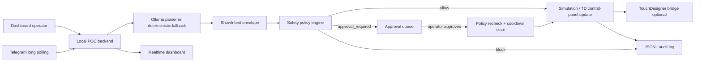

# Live Nervous System — AI Party Control POC

Live Nervous System is the local AI Party rehearsal POC. It runs a dashboard and
backend around the existing Show Director safety model: operator or Telegram
text becomes a structured `ShowIntent` envelope, the policy engine allows,
queues or blocks it, and dispatch stays simulated unless an explicitly approved
TouchDesigner visual update is possible.

> Do not connect real fog, strobe, DMX, PA, mixer, laser or moving-head control
> from this POC. Venue hardware needs a separate adapter, fixture map, emergency
> stop, cooldown validation and operator rehearsal.

## Architecture



## Safety Model

- Dry-run and rehearsal are the default.
- The LLM only proposes `ShowIntent` JSON; raw DMX, raw Python, arbitrary
  endpoints, channel numbers, blackout, freeze, laser, moving heads, mixer gain,
  PA mute and audio routing are blocked.
- Fog and hazer are approval-gated and capped at 3 seconds; fog intensity is
  capped at 0.45.
- Strobe is approval-gated and capped at 0.25 intensity.
- Approval is rechecked at approval time, including runtime cooldown state.
- Panic safe forces the local safe cue and zeros simulated fog/strobe.
- `HARDWARE_ENABLED` and `DMX_LIVE_ENABLED` are future-adapter gates, not a
  venue-ready hardware integration.

## Run

Install dependencies, then copy `.env.example` if you want local overrides.

```bash
npm ci
npm run ai-party:dry
npm run ai-party:test
npm run ai-party:dev
```

Open the printed dashboard URL, normally `http://127.0.0.1:8787/`.

## Dashboard

The dashboard includes command input, example chips, cue deck, approval queue,
live state, TouchDesigner preview status, event-log filters and a safety panel.
Keyboard shortcuts: number keys trigger cue buttons, `P` enters panic safe, and
`Ctrl+Space` sends the typed command.

Useful demo prompts:

```text
deixa a sala mais premium tropical
prepara fumaça curta no próximo drop
blackout total e strobo máximo e raw dmx
```

The first request should allow a safe visual state, the second should queue an
approval, and the third should block.

## Ollama

Set:

```bash
OLLAMA_BASE_URL=http://127.0.0.1:11434
OLLAMA_MODEL=qwen2.5:3b
```

No particular model is required. If Ollama is down or the model is missing, the
dashboard shows a warning and uses deterministic fallback parsing for the
built-in demo commands.

## TouchDesigner

Start the tdmcp bridge at `TD_BRIDGE_URL` and then run:

```bash
npm run ai-party:td-build
```

The builder creates or replaces `/project1/ai_party_poc` with a control panel,
visual chain, simulated DMX table, disabled DMX placeholder and `preview_out`.
Every created operator receives deterministic `nodeX`/`nodeY` coordinates.

When the bridge is available, the dashboard can read:

```text
/project1/ai_party_poc/preview_out
```

Cue and mood actions may update `/project1/ai_party_poc/control_panel`.
Physical-effect actions remain simulated.

## Telegram

Set:

```bash
TELEGRAM_BOT_TOKEN=...
TELEGRAM_ALLOWED_CHAT_IDS=123456789
TELEGRAM_POLLING_ENABLED=true
```

Then run:

```bash
npm run ai-party:telegram
```

Supported commands include `/status`, `/cues`, `/cue <cue_name>`,
`/mood <text>`, `/fog <seconds> <intensity>`, `/approve <approval_id>`,
`/reject <approval_id>`, `/panic` and `/demo`.

Telegram webhook mode is reserved for deployment work; local polling is the POC
path.

## What Is Not Proven

- Real hardware dispatch is not venue-validated.
- The TD network contains `sim_dmx_table` and `dmx_out_disabled`, not a live DMX
  output.
- Telegram webhooks, real STT, OpenClaw wiring, PA control, Ui24R scene recall
  and live fixture patching remain follow-up validation work.
- Turning on hardware flags without a real adapter and venue safety path is not
  a show-ready configuration.
